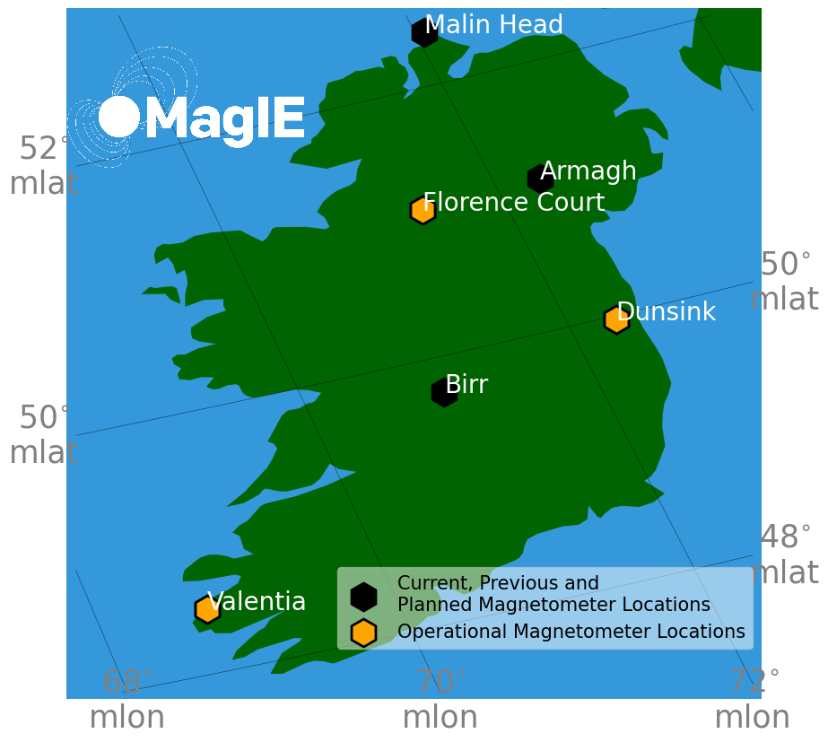

## Code useful for Irish magnetometers. Such as downloading from the website.

## Install Guide
### pip install
conda create -n magie python=3.12 # important to not use later python versions if building from pip

conda activate magie

pip install "git+https://github.com/magie-network/MAGIE.git@1.0.5"

For alert support with `pip`, install the `alerts` extra:

pip install "magie[alerts] @ git+https://github.com/magie-network/MAGIE.git@1.0.5"

This will install mastodon for mastodon alerts

This package temporarily depends on a GitHub commit of geomagpy
because the circular import fix is not yet released on PyPI.

### Build from environment file (not as limited with python version)
Alternatively:

conda env create -f ./binder/environment.yml

conda activate magie

This creates a development environment with the required dependencies but
does not install the `magie` package itself. For local development after
cloning the repository, install the package manually if needed, for example:

pip install -e .

For alert posting support, use the alerts environment instead:

conda env create -f ./binder/environment_alerts.yml

conda activate magie-alerts

## Tutorials
In the notebook folder a set of notebooks can be found to demonstrate how to use the magie package

# File Problems
- Cases of repeated time stamps with different measurement values for dunsink and armagh.
- some files have lines only part written as if it broke part way through writing the file (current download code removes these lines but still grabs the remaining good parts of the file)
- there are varied cadence for some sites some have only 1-min others sometimes have 1 second other times have 1 minute
- 
